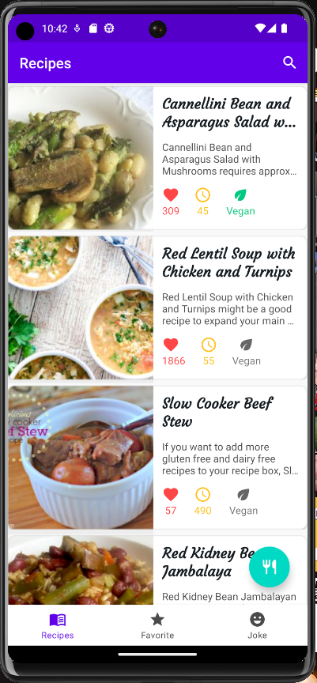
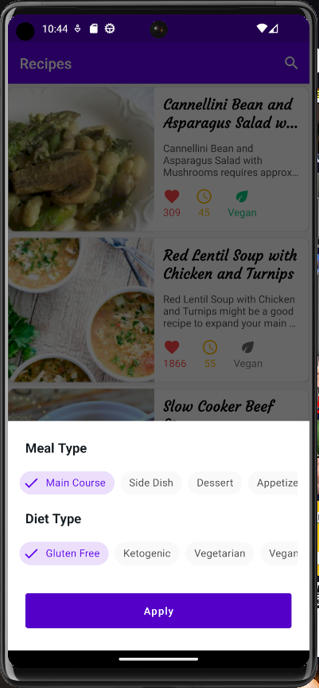
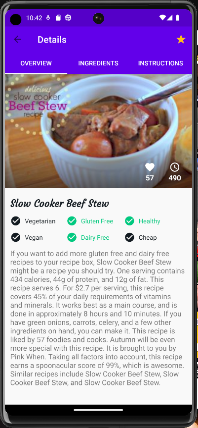
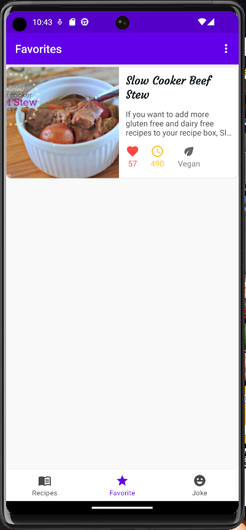

# Recipe App

## Project description
The Recipe App is an Android application designed to provide users with a culinary experience by offering a collection of recipes. This app aims to deliver an intuitive and visually appealing interface, making it easy for users to discover, explore, and save their favorite recipes.

## App design
The app should incorporate the following key design elements:

- **Navigation**: Create an intuitive and user-friendly navigation system that allows users to seamlessly browse through various recipes (should show random recipes by default), and recipes saved to favourites

- **Recipe details**: Design a clear and engaging interface for displaying comprehensive information about individual recipes. This should include ingredients, instructions, cooking time, and etc.

- **Search and filter**: Implement a search feature that empowers users to easily find specific recipes based on ingredients, cuisine, and more. Optionally implement filtering feature.

- **Favorites**: Provide users with the ability save favorite recipes.









## Project phases
1. **Project setup and UI design (Days 1-2)**
    - Download and install [Android Studio](https://developer.android.com/studio)
    - Set up the Android project.
    - Implement the user interface (UI) with a focus on user-friendly navigation and recipe display.

2. **Data integration and API (Days 2-3)**
    - Integrate data from the Spoonacular API.
    - Create an interface to fetch recipe details, images, and attributes.
    - Implement asynchronous data retrieval for a smooth user experience.

3. **Search and filter functionality (Days 4-5)**
    - Develop search feature for users to find recipes by name, ingredients, cuisine, and etc.
    - Optionally implement a filtering feature, that enables users to filter recipes by different parameters

4. **Favorites and notifications(Days 5-6)**
    - Allow users to save favorite recipes and view their cooking history.
    - Implement a user notification of your choosing (e.g. notification when user did not enter the app for some time, or random notifications with recipe recommendations)

## Technologies and tools
To implement the design goals, you can utilize the following technologies and tools:
- Android Studio
- Kotlin
- Retrofit for network requests
- Spoonacular API for retrieving recipe data
- Coroutines for asynchronous operations
- Room for local data storage
- LiveData/Flow for real-time UI updates
- WorkManager for background task scheduling

## Project timeline
The project is expected to be completed within 5-6 business days.

## How to use the Spoonacular API
For recipe data retrieval, utilize the [Spoonacular API](https://spoonacular.com/food-api/docs). Refer to the API's official documentation to understand the available data and endpoints.
To make the most of the API, ensure that the app's design incorporates the relevant recipe attributes and characteristics.

Utilize [Random recipes](https://spoonacular.com/food-api/docs#Get-Random-Recipes) to retrieve the initial recipes for home screen.
To implement filtering and search you can use the provided [Complex search](https://spoonacular.com/food-api/docs#Search-Recipes-Complex).

Feel free to use any of the functionality available in this API to further expand and modify the app. As using [Get similar recipes](https://spoonacular.com/food-api/docs#Get-Similar-Recipes), to provide similar recipes on details screen.

## Example of API call:


## Example of JSON Response:
```json
{
    "offset": 0,
    "number": 2,
    "results": [
        {
            "id": 716429,
            "title": "Pasta with Garlic, Scallions, Cauliflower & Breadcrumbs",
            "image": "https://spoonacular.com/recipeImages/716429-312x231.jpg",
            "imageType": "jpg",
        },
        {
            "id": 715538,
            "title": "What to make for dinner tonight?? Bruschetta Style Pork & Pasta",
            "image": "https://spoonacular.com/recipeImages/715538-312x231.jpg",
            "imageType": "jpg",
        }
    ],
    "totalResults": 86
}
